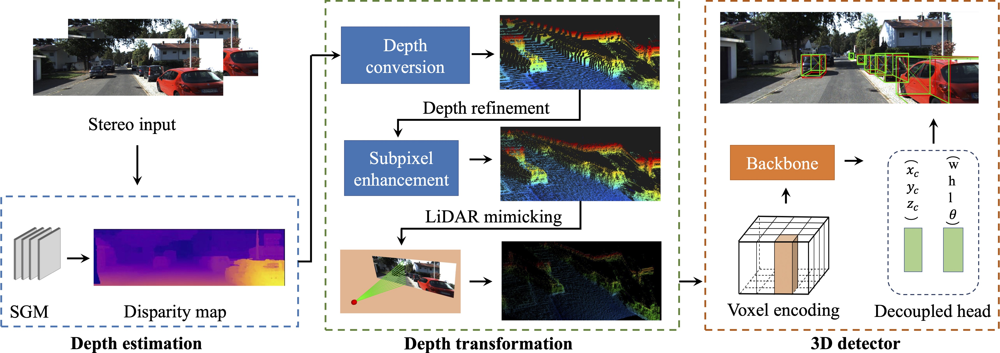

# AR3D: An Accurate and Real-time 3D Object Detection Framework for Autonomous Driving
This is the official repository for ''AR3D: An Accurate and Real-time 3D Object Detection Framework for Autonomous Driving''

Due to the double-blind principle, this repository including the video 
is published as an anonymous resource.


## Overview
<div align="center">
    
    <p> <b>System Overview</b> </p>
</div>


## Demo video
[[Video](https://www.youtube.com/watch?v=vVc9HqoUgc4)]

## How to run

environment
```shell
pytorch=1.10.1
torchvision=0.11.2
cuda=10.2
cudnn=7.6.5
```

preparation
```shell
conda install pytorch torchvision cudatoolkit
pip install spconv-cu102
cd utils/iou3d_nms
python setup.py develop
```

run test
```shell
python test.py
```
## Acknowledgement
- [**OpenPCDet**](https://github.com/open-mmlab/OpenPCDet)
